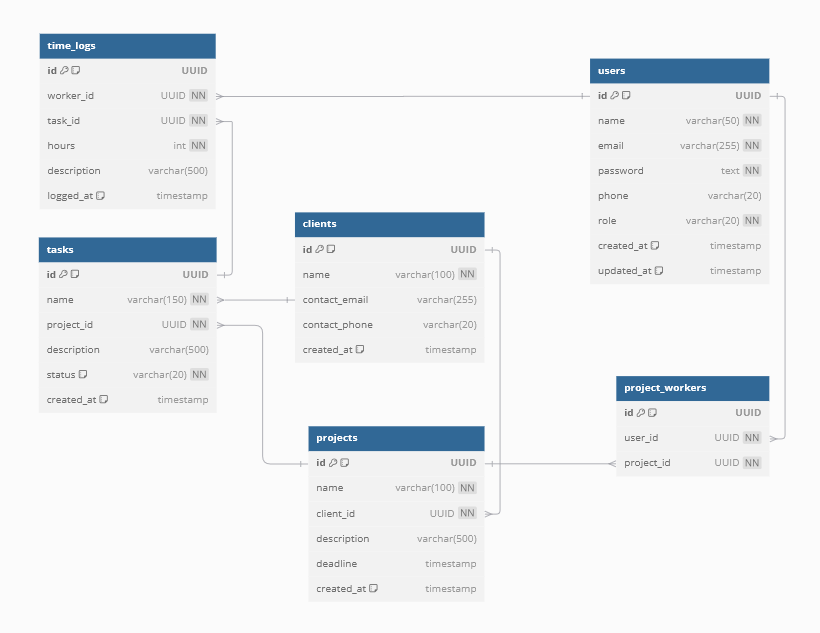

TODO:
1. fetch user chats in clusters
2. read more about user chat history storage (maybe some data needs to be encrypted)

## Database Structure (sql) v1.1

link to the dbdiagram
https://dbdiagram.io/d/67bf0126263d6cf9a086c6d4

```
CREATE TABLE workspaces (
    id UUID DEFAULT gen_random_uuid() PRIMARY KEY,
    name VARCHAR(100) NOT NULL,
    description VARCHAR(500),
    created_at TIMESTAMP DEFAULT CURRENT_TIMESTAMP,
    updated_at TIMESTAMP DEFAULT CURRENT_TIMESTAMP,
    UNIQUE (name)
);

CREATE TABLE users (
    id UUID DEFAULT gen_random_uuid() PRIMARY KEY,
    name VARCHAR(50) NOT NULL,
    email VARCHAR(255) NOT NULL UNIQUE,
    password TEXT NOT NULL,
    phone VARCHAR(20),
    created_at TIMESTAMP DEFAULT CURRENT_TIMESTAMP,
    updated_at TIMESTAMP DEFAULT CURRENT_TIMESTAMP
);

CREATE TABLE workspace_users (
    id UUID DEFAULT gen_random_uuid() PRIMARY KEY,
    user_id UUID NOT NULL,
    workspace_id UUID NOT NULL,
    role VARCHAR(20) NOT NULL CHECK (role IN ('OWNER', 'ADMIN', 'USER')),
    created_at TIMESTAMP DEFAULT CURRENT_TIMESTAMP,
    updated_at TIMESTAMP DEFAULT CURRENT_TIMESTAMP,
    FOREIGN KEY (user_id) REFERENCES users(id) ON DELETE CASCADE,
    FOREIGN KEY (workspace_id) REFERENCES workspaces(id) ON DELETE CASCADE,
    UNIQUE (user_id, workspace_id)
);

CREATE TABLE clients (
    id UUID DEFAULT gen_random_uuid() PRIMARY KEY,
    workspace_id UUID NOT NULL,
    name VARCHAR(100) NOT NULL,
    contact_email VARCHAR(255),
    contact_phone VARCHAR(20),
    created_at TIMESTAMP DEFAULT CURRENT_TIMESTAMP,
    updated_at TIMESTAMP DEFAULT CURRENT_TIMESTAMP,
    FOREIGN KEY (workspace_id) REFERENCES workspaces(id) ON DELETE CASCADE,
    UNIQUE (workspace_id, name) 
);

CREATE TABLE projects (
    id UUID DEFAULT gen_random_uuid() PRIMARY KEY,
    workspace_id UUID NOT NULL,
    client_id UUID NOT NULL,
    name VARCHAR(100) NOT NULL,
    description VARCHAR(500),
    deadline TIMESTAMP,
    created_at TIMESTAMP DEFAULT CURRENT_TIMESTAMP,
    updated_at TIMESTAMP DEFAULT CURRENT_TIMESTAMP,
    FOREIGN KEY (workspace_id) REFERENCES workspaces(id) ON DELETE CASCADE,
    FOREIGN KEY (client_id) REFERENCES clients(id) ON DELETE CASCADE,
    UNIQUE (workspace_id, name)
);

CREATE TABLE project_users (
    id UUID DEFAULT gen_random_uuid() PRIMARY KEY,
    user_id UUID NOT NULL,
    project_id UUID NOT NULL,
    role VARCHAR(20) NOT NULL CHECK (role IN ('OWNER', 'ADMIN', 'USER')),
    created_at TIMESTAMP DEFAULT CURRENT_TIMESTAMP,
    updated_at TIMESTAMP DEFAULT CURRENT_TIMESTAMP,
    FOREIGN KEY (user_id) REFERENCES users(id) ON DELETE CASCADE,
    FOREIGN KEY (project_id) REFERENCES projects(id) ON DELETE CASCADE,
    UNIQUE (user_id, project_id)
);


CREATE TABLE tasks (
    id UUID DEFAULT gen_random_uuid() PRIMARY KEY,
    project_id UUID NOT NULL,
    name VARCHAR(150) NOT NULL,
    description VARCHAR(500),
    status VARCHAR(20) NOT NULL DEFAULT 'PENDING' CHECK (status IN ('PENDING', 'IN_PROGRESS', 'COMPLETED')),
    created_at TIMESTAMP DEFAULT CURRENT_TIMESTAMP,
    updated_at TIMESTAMP DEFAULT CURRENT_TIMESTAMP,
    FOREIGN KEY (project_id) REFERENCES projects(id) ON DELETE CASCADE
);

CREATE TABLE time_logs (
    id UUID DEFAULT gen_random_uuid() PRIMARY KEY,
    user_id UUID NOT NULL,
    task_id UUID NOT NULL,
    hours INT NOT NULL CHECK (hours > 0),
    description VARCHAR(500),
    logged_at TIMESTAMP DEFAULT CURRENT_TIMESTAMP,
    created_at TIMESTAMP DEFAULT CURRENT_TIMESTAMP,
    updated_at TIMESTAMP DEFAULT CURRENT_TIMESTAMP,
    FOREIGN KEY (user_id) REFERENCES users(id) ON DELETE CASCADE,
    FOREIGN KEY (task_id) REFERENCES tasks(id) ON DELETE CASCADE
);

CREATE TABLE chat_messages (
    id UUID DEFAULT gen_random_uuid() PRIMARY KEY,
    content VARCHAR(1000) NOT NULL,
    sender_id UUID NOT NULL,
    recipient_email VARCHAR(255) NOT NULL,
    created_at TIMESTAMP DEFAULT CURRENT_TIMESTAMP,
    FOREIGN KEY (sender_id) REFERENCES users(id) ON DELETE CASCADE
);

```