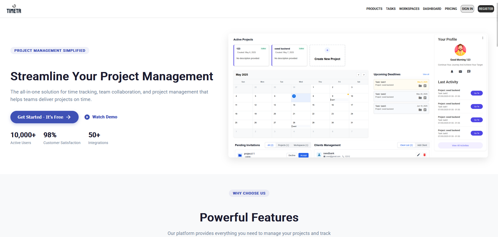

https://springdoc.org/

## Database Structure (sql) v1.2

link to the dbdiagram
https://dbdiagram.io/d/67bf0126263d6cf9a086c6d4

```
-- Enum Tables
CREATE TYPE activity_type AS ENUM (
    'TASK_COMPLETED',
    'COLLABORATOR_JOINED',
    'DEADLINE_UPDATED',
    'PROJECT_CREATED',
    'TASK_CREATED',
    'TASK_UPDATED',
    'COLLABORATOR_INVITED',
    'PROJECT_UPDATED',
    'TASK_DELETED',
    'TIME_LOG_LINKED'
);

CREATE TYPE invitation_status AS ENUM (
    'PENDING',
    'ACCEPTED',
    'REJECTED'
);

CREATE TYPE role AS ENUM (
    'OWNER',
    'ADMIN',
    'MANAGER',
    'USER'
);

CREATE TYPE task_status AS ENUM (
    'PENDING',
    'ASSIGNED',
    'IN_PROGRESS',
    'COMPLETED',
    'REOPENED'
);

CREATE TYPE task_action AS ENUM (
    'CREATED',
    'UPDATED',
    'ASSIGNED',
    'COMPLETED',
    'STATUS_CHANGED',
    'REOPENED',
    'DELETED'
);

-- Users Table
CREATE TABLE users (
    id UUID PRIMARY KEY,
    name VARCHAR(50) NOT NULL,
    email VARCHAR(255) NOT NULL UNIQUE,
    password VARCHAR(255) NOT NULL,
    phone VARCHAR(20),
    role role NOT NULL,
    created_at TIMESTAMP NOT NULL DEFAULT CURRENT_TIMESTAMP,
    updated_at TIMESTAMP NOT NULL DEFAULT CURRENT_TIMESTAMP
);

-- Workspaces Table
CREATE TABLE workspaces (
    id UUID PRIMARY KEY,
    user_id UUID NOT NULL REFERENCES users(id),
    name VARCHAR(100) NOT NULL,
    description VARCHAR(500),
    created_at TIMESTAMP NOT NULL DEFAULT CURRENT_TIMESTAMP,
    updated_at TIMESTAMP NOT NULL DEFAULT CURRENT_TIMESTAMP
);

-- Workspace Users Table
CREATE TABLE workspace_users (
    id UUID PRIMARY KEY,
    user_id UUID NOT NULL REFERENCES users(id),
    workspace_id UUID NOT NULL REFERENCES workspaces(id),
    role role NOT NULL,
    created_at TIMESTAMP NOT NULL DEFAULT CURRENT_TIMESTAMP,
    updated_at TIMESTAMP NOT NULL DEFAULT CURRENT_TIMESTAMP
);

-- Workspace Invitations Table
CREATE TABLE workspace_invitations (
    id UUID PRIMARY KEY,
    workspace_id UUID NOT NULL REFERENCES workspaces(id),
    invited_user_id UUID NOT NULL REFERENCES users(id),
    sender_id UUID NOT NULL REFERENCES users(id),
    role role NOT NULL,
    status invitation_status NOT NULL,
    created_at TIMESTAMP NOT NULL DEFAULT CURRENT_TIMESTAMP,
    updated_at TIMESTAMP NOT NULL DEFAULT CURRENT_TIMESTAMP
);

-- Clients Table
CREATE TABLE clients (
    id UUID PRIMARY KEY,
    workspace_id UUID NOT NULL REFERENCES workspaces(id),
    name VARCHAR(100) NOT NULL,
    contact_email VARCHAR(255),
    contact_phone VARCHAR(20),
    created_at TIMESTAMP NOT NULL DEFAULT CURRENT_TIMESTAMP,
    updated_at TIMESTAMP NOT NULL DEFAULT CURRENT_TIMESTAMP
);

-- Projects Table
CREATE TABLE projects (
    id UUID PRIMARY KEY,
    workspace_id UUID NOT NULL REFERENCES workspaces(id),
    client_id UUID REFERENCES clients(id),
    name VARCHAR(100) NOT NULL,
    description VARCHAR(500),
    deadline TIMESTAMP,
    created_at TIMESTAMP NOT NULL DEFAULT CURRENT_TIMESTAMP,
    updated_at TIMESTAMP NOT NULL DEFAULT CURRENT_TIMESTAMP
);

-- Project Users Table
CREATE TABLE project_users (
    id UUID PRIMARY KEY,
    user_id UUID NOT NULL REFERENCES users(id),
    project_id UUID NOT NULL REFERENCES projects(id),
    role role NOT NULL,
    created_at TIMESTAMP NOT NULL DEFAULT CURRENT_TIMESTAMP,
    updated_at TIMESTAMP NOT NULL DEFAULT CURRENT_TIMESTAMP
);

-- Project Invitations Table
CREATE TABLE project_invitations (
    id UUID PRIMARY KEY,
    project_id UUID NOT NULL REFERENCES projects(id),
    invited_user_id UUID NOT NULL REFERENCES users(id),
    sender_id UUID NOT NULL REFERENCES users(id),
    role role NOT NULL,
    status invitation_status NOT NULL,
    created_at TIMESTAMP NOT NULL DEFAULT CURRENT_TIMESTAMP,
    updated_at TIMESTAMP NOT NULL DEFAULT CURRENT_TIMESTAMP
);

-- Tasks Table
CREATE TABLE tasks (
    id UUID PRIMARY KEY,
    project_id UUID NOT NULL REFERENCES projects(id),
    name VARCHAR(150) NOT NULL,
    assigned_to_user_id UUID REFERENCES users(id),
    assigned_by_user_id UUID REFERENCES users(id),
    assigned_at TIMESTAMP,
    description VARCHAR(500),
    status task_status NOT NULL DEFAULT 'PENDING',
    deadline TIMESTAMP,
    created_at TIMESTAMP NOT NULL DEFAULT CURRENT_TIMESTAMP,
    updated_at TIMESTAMP NOT NULL DEFAULT CURRENT_TIMESTAMP,
    created_by UUID REFERENCES users(id),
    last_modified_by UUID REFERENCES users(id)
);

-- Task Assignments Table
CREATE TABLE task_assignments (
    id UUID PRIMARY KEY,
    task_id UUID NOT NULL REFERENCES tasks(id),
    user_id UUID NOT NULL REFERENCES users(id),
    assigned_by UUID NOT NULL REFERENCES users(id),
    assigned_at TIMESTAMP NOT NULL DEFAULT CURRENT_TIMESTAMP
);

-- Task Logs Table
CREATE TABLE task_logs (
    id UUID PRIMARY KEY,
    task_id UUID NOT NULL REFERENCES tasks(id),
    user_id UUID REFERENCES users(id),
    action task_action NOT NULL,
    details VARCHAR(500),
    timestamp TIMESTAMP NOT NULL DEFAULT CURRENT_TIMESTAMP
);

-- Time Logs Table
CREATE TABLE time_logs (
    id UUID PRIMARY KEY,
    user_id UUID NOT NULL REFERENCES users(id),
    task_id UUID REFERENCES tasks(id),
    project_id UUID NOT NULL REFERENCES projects(id),
    start_time TIMESTAMP,
    end_time TIMESTAMP,
    minutes INTEGER,
    description VARCHAR(500) NOT NULL DEFAULT '',
    logged_at TIMESTAMP NOT NULL DEFAULT CURRENT_TIMESTAMP,
    created_at TIMESTAMP NOT NULL DEFAULT CURRENT_TIMESTAMP,
    updated_at TIMESTAMP NOT NULL DEFAULT CURRENT_TIMESTAMP
);

-- Activities Table
CREATE TABLE activities (
    id UUID PRIMARY KEY,
    project_id UUID NOT NULL REFERENCES projects(id),
    user_id UUID NOT NULL REFERENCES users(id),
    type activity_type NOT NULL,
    description VARCHAR(500),
    created_at TIMESTAMP NOT NULL DEFAULT CURRENT_TIMESTAMP
);

-- Chat Messages Table
CREATE TABLE chat_messages (
    id UUID PRIMARY KEY,
    content VARCHAR(1000) NOT NULL,
    sender_id UUID NOT NULL REFERENCES users(id),
    recipient_email VARCHAR(255) NOT NULL,
    created_at TIMESTAMP NOT NULL DEFAULT CURRENT_TIMESTAMP
);
```

